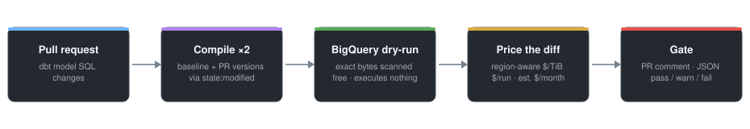
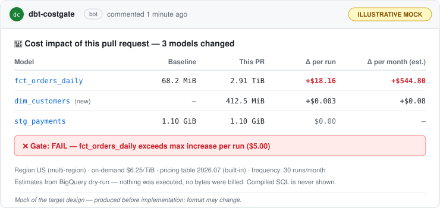

<div align="center">


# costgate

**The BigQuery cost gate for dbt pull requests.**

Dry-run what changed, price the diff, and catch the $500-a-day model<br/>*before* it merges — not on next month's bill.

[](https://github.com/Drichards124/costgate/actions/workflows/ci.yml)
[](https://github.com/Drichards124/costgate/actions/workflows/ple.yml)
[](pyproject.toml)
[](LICENSE)
[](https://docs.astral.sh/ruff/)
[](#roadmap)

[How it works](#how-it-works) ·
[What you get](#what-you-get-on-every-pr) ·
[Where it fits](#where-it-fits) ·
[Pricing accuracy](#accurate-transparent-pricing) ·
[Security](#security-model) ·
[Roadmap](#roadmap) ·
[Contributing](CONTRIBUTING.md)

</div>

> [!IMPORTANT]
> **Pre-MVP.** This repository currently contains the project definition and scaffold.
> Output shown below is an illustrative mock of the target design — follow the
> [roadmap](#roadmap) or the [changelog](CHANGELOG.md) for progress.

---

## The problem

On dbt + BigQuery teams, SQL changes merge with **zero visibility into their cost
impact**. A changed join, a dropped partition filter, or a widened incremental
window can multiply a model's bytes scanned — and the team finds out days later
on the bill, or when finance escalates.

BigQuery's dry-run API returns the *exact* bytes a query would scan — **for
free, before running anything**. costgate packages that into a first-class PR
gate:

<div align="center">



</div>

## What you get on every PR

<div align="center">



</div>

<details>
<summary><b>💻 The same check, locally — before you even open the PR</b></summary>
<br/>

```text
$ costgate check --baseline .costgate/prod-manifest.json
costgate — region: US (multi-region) · on-demand $6.25/TiB · source: built-in table 2026.07

  model                     baseline      this branch       Δ per run    est. Δ per month
  ─────────────────────────────────────────────────────────────────────────────────────
  fct_orders_daily          68.2 MiB   →  2.91 TiB          +$18.16      +$544.80  (30 runs)
  dim_customers  (new)      —          →  412.5 MiB         +$0.003      +$0.08    (30 runs)
  stg_payments              1.10 GiB   →  1.10 GiB           $0.00       —

  GATE: FAIL — fct_orders_daily exceeds max increase per run ($5.00)
```

*(Illustrative output — format may change before the first release.)*

</details>

## How it works

| Step | What happens | Cost to you |
|------|--------------|-------------|
| 1 · **Find what changed** | dbt's `state:modified` selector against a baseline manifest (your production artifacts), with a git-diff fallback | free |
| 2 · **Compile both versions** | The baseline and PR-branch versions of each changed model | free |
| 3 · **Dry-run each** | BigQuery `dryRun=true` returns exact bytes scanned — executes nothing, reads no table data | **free** |
| 4 · **Price the diff** | Region-aware on-demand rates; optionally × run frequency for $/month | free |
| 5 · **Gate** | Markdown PR comment, machine-readable JSON, policy-driven exit code (fail on $ and/or % increase) | free |

## Where it fits

costgate is the **preventive** half of BigQuery cost control — it deliberately
does not compete with the excellent retrospective tools:

| The question you're asking | Reach for |
|---|---|
| "What *did* our warehouse cost, by model / user / query?" | [dbt-bigquery-monitoring](https://github.com/bqbooster/dbt-bigquery-monitoring) |
| "What does the dbt platform estimate my models cost?" | [dbt Cost Insights](https://docs.getdbt.com/docs/explore/cost-insights) |
| "What is **this PR about to do** to our bill?" | **costgate** |

## Accurate, transparent pricing

BigQuery on-demand rates differ by region — a gate that prices every byte at
the US rate is silently wrong for half the world. costgate treats pricing
accuracy as a feature:

- 🌍 **Versioned per-region pricing table** with a `last_verified` date, auto-selected from your job's detected region.
- 🧾 **Every report discloses its math** — region, rate, and rate source. Never a silent assumption:

  ```text
  region: US (multi-region) · on-demand $6.25/TiB · source: built-in table 2026.07
  ```

- ⚙️ **Overridable** — `pricing.region` to force a region, `pricing.usd_per_tib` for negotiated or editions rates.
- ⚠️ **Honest limits, stated up front** — under capacity/editions pricing, bytes scanned is a proxy signal, not your invoice; the 1 TiB/month free tier is not modeled by default.

## Security model

This tool runs in CI next to warehouse credentials, so the design is
deliberately boring:

| Threat | Design answer |
|---|---|
| Billable or data-reading queries | **Dry-run only.** The single warehouse interaction is `jobs.insert` with `dryRun=true` — free, executes nothing |
| Credential theft / mishandling | **No credential surface.** Auth delegates entirely to [Application Default Credentials](https://cloud.google.com/docs/authentication/application-default-credentials); in CI the documented path is keyless [Workload Identity Federation](https://github.com/google-github-actions/auth). There are no credential flags to misuse |
| Compromised CI runner | **Least privilege.** BigQuery Job User + metadata read — no data access, no writes; docs ship the exact IAM setup |
| Malicious fork PRs | **Fork-safe by default.** Documented workflows use the `pull_request` trigger; fork PRs degrade to "no report", never to exposed secrets |
| Secrets templated into SQL | **No compiled SQL in reports** — model names, bytes, and dollars only; snippets are strictly opt-in |
| Phone-home | **No telemetry.** The only network call is to the BigQuery API |

Details in [SECURITY.md](SECURITY.md) · deeper design notes in [docs/architecture.md](docs/architecture.md).

## Roadmap

- [ ] **MVP** — `costgate check` (local + CI), region-aware pricing, threshold policy
- [ ] **GitHub Action** wrapper with a sticky PR comment
- [ ] **`pre-commit` hook** entry
- [ ] **Docker image** on ghcr.io (GitLab CI–friendly)
- [ ] **Live pricing** (opt-in) via the Cloud Billing Catalog API

## Non-goals

- **Not a monitoring tool** — retrospective observability belongs to [dbt-bigquery-monitoring](https://github.com/bqbooster/dbt-bigquery-monitoring).
- **BigQuery only** — one warehouse done accurately beats three done approximately.
- **Never runs billable queries** — features that require executing real queries are out of scope by design.
- **No IDE/editor integration** (for now).

---

<div align="center">

[Contributing](CONTRIBUTING.md) ·
[Security policy](SECURITY.md) ·
[Changelog](CHANGELOG.md) ·
[Code of Conduct](CODE_OF_CONDUCT.md) ·
[Apache-2.0](LICENSE) · [NOTICE](NOTICE)

Built by [Dashan Richards](https://github.com/Drichards124) — DCO sign-off required, hard invariants apply:<br/>
**dry-run only · no credential handling · no telemetry**

</div>
