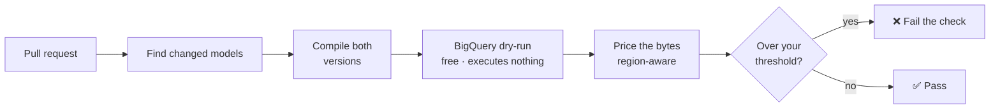
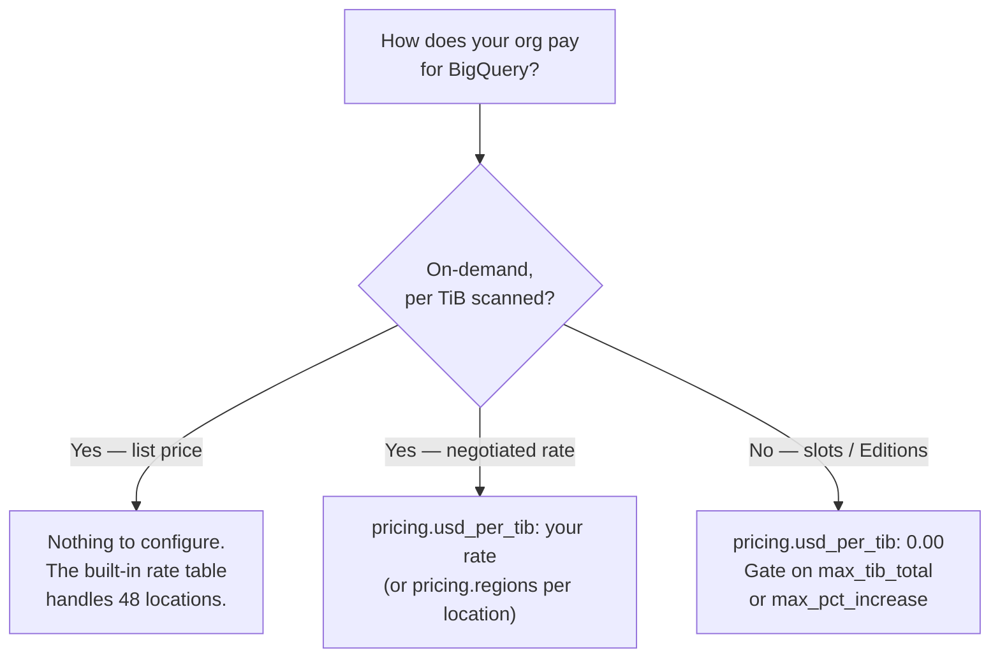

<!-- SPDX-License-Identifier: Apache-2.0 -->

# dbt-costgate, explained

A plain-English guide to what this tool does, what it costs you, what every
setting means, and — just as importantly — what it deliberately refuses to do.

If you only read one line: **dbt-costgate tells you what a dbt pull request is
about to do to your BigQuery bill, before it merges, without running a single
billable query.**

---

## What's in this page

Jump straight to what you need:

| Section | What you'll find | Read it when |
|---|---|---|
| [The short version](#the-short-version) | What it does, in five sentences | You're deciding whether this is for you |
| [How it works](#how-it-works) | The pipeline, step by step | You want to know where the numbers come from |
| [The two ways to run it](#the-two-ways-to-run-it) | Local check vs. CI gate | You're setting it up |
| [What it costs to run](#what-it-costs-to-run) | Why the tool itself is free | Someone asks "does this scan my data?" |
| [Which pricing setup are you?](#which-pricing-setup-are-you) | On-demand, negotiated, or slots | Your figures look wrong, or you're on Editions |
| [Every configuration key](#every-configuration-key) | Every setting, generated from the code | You want to know what a key does |
| [What it will not do](#what-it-will-not-do) | Deliberate non-goals | You're about to request a feature |
| [When the number can be wrong](#when-the-number-can-be-wrong) | Honest accuracy limits | You're comparing it against your invoice |

Two other documents sit alongside this one: [usage.md](usage.md) is the
task-oriented how-to, and [architecture.md](architecture.md) is the design
rationale for contributors.

---

## The short version

BigQuery can tell you **exactly** how many bytes a query would scan without
running it. That's a dry run, and it's free.

dbt-costgate takes the models your pull request changed, compiles both the old and
new versions, dry-runs each one, converts bytes into money at your region's rate,
and reports the difference. If the increase crosses a threshold you set, the check
fails and the pull request is blocked.

That's the whole idea. Everything below is detail.

---

## How it works



**Find changed models.** Preferably by comparing your branch's compiled dbt
artifacts against `main`'s. It catches more than edited `.sql` files: a changed
macro or a changed config that alters a model's compiled SQL counts too, because
those change what the query scans just as surely.

**Compile both versions.** A cost *difference* needs a before and an after. The
"before" is `main`, compiled the same way your branch was.

**Dry-run each one.** `dryRun=true`. BigQuery returns the byte count it would
scan. Nothing executes, no table data is read, and nothing is billed.

**Price the bytes.** Bytes become money at your region's published rate. Rates
vary by region — from USD 6.25/TiB up to USD 11.25/TiB — so the region matters.
Every report states which rate it used and where that rate came from.

**Gate.** Compare against the thresholds you set and choose an exit code. Nothing
is blocked unless you configured a threshold.

---

## The two ways to run it

**Locally, with no setup.** Compile, then check. It prints what each changed model
scans and what that costs. No baseline, no config, no CI:

```bash
dbt compile
dbt-costgate check
```

**In CI, as a gate.** Give it `main`'s compiled manifest as a baseline and some
thresholds, and it reports the *change* and can block the merge. The GitHub Action
posts a sticky comment that updates in place on every push.

The local mode still gates, using absolute ceilings that need no baseline —
`--max-usd-total` and `--max-tib-total` cap a single model's total, rather than
its increase.

---

## What it costs to run

Nothing, and that is a design constraint rather than a happy accident.

- **Dry runs are free.** They are BigQuery's query-validation path. No bytes are
  billed and no table data is read.
- **The tool never issues any other kind of query.** Not to `INFORMATION_SCHEMA`,
  not for metadata, not "just this once". A change that would issue a billable
  query is treated as a vulnerability, not a feature.
- **It never handles a credential.** Authentication is delegated entirely to
  Application Default Credentials, the same chain dbt-bigquery already uses. There
  are no credential flags to pass and nothing to leak.
- **It has no telemetry.** The BigQuery API is the only endpoint it talks to.
- **Compiled SQL never appears in a report.** SQL can embed secrets through
  `env_var()`, so reports carry model names and numbers only.

---

## Which pricing setup are you?

This is the question that most often explains a surprising figure. Follow it once:



**On-demand at list price.** Nothing to do. The bundled table covers 48 locations
with published rates and states which one it applied.

**A negotiated or Editions rate.** Set your rate and it wins over the table
everywhere. Your override always beats the built-in numbers — that precedence is
deliberate, so updating the bundled table can never silently overwrite the price
you actually pay.

**Capacity or slot pricing.** This one needs saying plainly: **slot cost cannot be
estimated before a query runs.** A dry run reports bytes, never slot time, and
slot consumption only exists once a job has executed. Estimating it would require
running the query, which this tool will not do.

So under slots, bytes scanned is a measure of *work*, not of your invoice. Set the
rate to `0.00` and reports stop showing money entirely — no column of `0.00` to
misread — and gate on the two thresholds that need no rate at all:
`max_tib_total` and `max_pct_increase`. A percentage has no currency, so it works
regardless of how you pay.

Worked examples of all three, generated from the real code, are in
[usage.md](usage.md#what-the-report-looks-like-in-your-setup).

### A note on currency

Amounts carry an ISO 4217 code — `USD 6.25/TiB` — rather than a symbol, because
`$` is also CAD, AUD and SGD. Set `pricing.currency` to label amounts in yours.

**It labels; it never converts.** The setting means "the rate I gave you is
denominated in this", not "convert into this". Because the bundled table is in US
dollars, declaring another currency while any region is still priced from that
table stops the run rather than printing a US dollar figure under your label.

---

## Every configuration key

All of these live in `.dbt-costgate.yml` in your project, which travels with your
repo — so it applies identically on your laptop and in CI.

You can also print this table at any time with `dbt-costgate config`.

> This table is generated from the same registry the code reads, so it cannot
> describe a key that does not exist or omit one that does.

<!-- BEGIN GENERATED: config-reference -->
<!-- Generated by scripts/gen_samples.py from the real renderers. Do not edit by hand. -->
| Key | Type | Default | What it does |
|---|---|---|---|
| `pricing.region` | `str` | _none_ | Force the pricing region. Default: auto-detected from the dry-run job location, falling back to US. |
| `pricing.usd_per_tib` | `float` | _none_ | Flat on-demand rate override (USD/TiB) for every region. Default: the built-in per-region rate table. |
| `pricing.currency` | `str` | _none_ | ISO 4217 code the reported amounts are labelled with, e.g. EUR. Default: USD, matching the built-in table. This labels a rate you supplied yourself — dbt-costgate never converts between currencies — so any region still priced from the built-in table is an error, not a conversion. |
| `pricing.regions` | `map[str->float]` | _empty_ | Per-region rate overrides (region -> USD/TiB) that patch the built-in table. Keys match case-insensitively; 0 is allowed. Unlisted regions use the table. |
| `thresholds.max_usd_increase_per_run` | `float` | _none_ | Gate fails if a model's per-run cost increase exceeds this many USD. |
| `thresholds.max_pct_increase` | `float` | _none_ | Gate fails if a model's cost increases by more than this percent. |
| `thresholds.max_usd_increase_per_month` | `float` | _none_ | Gate fails if a model's projected monthly cost increase exceeds this many USD. |
| `thresholds.max_usd_total` | `float` | _none_ | Absolute ceiling: gate fails if a model's total per-run cost exceeds this many USD, regardless of its increase. Needs no baseline (works in local mode). |
| `thresholds.max_tib_total` | `float` | _none_ | Absolute ceiling: gate fails if a model's total per-run scan exceeds this many TiB, regardless of its increase. Needs no baseline (works in local mode). |
| `run_frequency.default` | `int` | _none_ | Assumed runs per month for the monthly-cost estimate, for models without an explicit entry. |
| `run_frequency.models` | `map[str->int]` | _empty_ | Per-model runs-per-month overrides (model name -> runs) for the monthly estimate. |
| `exclude` | `list[str]` | _empty_ | Model names reported but never gated. |
| `warn_only` | `list[str]` | _empty_ | Model names shown as a warning instead of gated. |
| `renames` | `map[str->str]` | _empty_ | Pair a renamed model to its baseline for a diff (current -> baseline), for when a model rename changes its unique_id and auto-matching can't. Each side is a model name or a full unique_id. Requires a baseline (diff mode). |
| `baselines` | `map[str->{manifest|against}]` | _empty_ | Named baseline sources (dbt --target analogy). Each name maps to either a `manifest:` path or an `against:` git ref. Select one with --baseline-target <name>; a `manifest` target travels to CI, an `against` target needs git+dbt. |
| `default_baseline` | `str` | _none_ | Name of the `baselines:` entry to use when no --baseline/--against/--baseline-target is given, so `dbt-costgate check` diffs without a flag. |
| `report.format` | `terminal|markdown|json` | `terminal` | Output format when not overridden by --format. |
| `fail_on` | `never|warn|fail` | `fail` | Gate strictness: 'never' never fails the build, 'warn' fails on warnings, 'fail' fails only on threshold breaches. |
<!-- END GENERATED: config-reference -->

Every CLI flag has a matching GitHub Action input, so anything you can do locally
you can do in CI.

---

## What it will not do

These are deliberate, and each one was decided rather than overlooked.

**It is not a monitoring tool.** It answers "what is *this change* about to do?",
not "what did we spend last month?". Retrospective analysis belongs to
[dbt-bigquery-monitoring](https://github.com/bqbooster/dbt-bigquery-monitoring),
which is complementary, not a competitor.

**It never runs a billable query.** This one has already refused a genuinely
useful feature: reading real per-run scan bytes from `INFORMATION_SCHEMA.JOBS`
would have retired two accuracy caveats below, and it was declined because those
are real queries, billed at a 10 MB minimum. The objection is categorical, not
economic.

**It is BigQuery-first.** One warehouse done accurately beats three done
approximately. Other warehouses come only where the cost model genuinely
transfers — and for slot-based warehouses, per the section above, much of it does
not.

**It does not convert currencies**, model the free tier, or estimate slot cost.

---

## When the number can be wrong

Stated up front, because a cost tool that hides its error bars is worse than none.

**Incremental models are priced as a full refresh.** dbt-costgate compares
compiled SQL, and an incremental model's compiled form depends on what already
exists in the warehouse. It uses the full-refresh form on both sides — an
apples-to-apples comparison — and labels it `full-refresh`. So the figure is your
rebuild cost, not your typical incremental run.

**Monthly figures use an assumption you supply.** `run_frequency` is a number you
configure, not something measured. If a model actually runs 90 times a month and
you told it 30, the monthly figure is a third of reality.

**Dynamic filters read as worst case.** A predicate like `CURRENT_DATE()` cannot
be resolved at dry-run time, so BigQuery reports a full-table scan. Those models
are flagged, and you can exclude them or mark them warn-only.

**The free tier is not modelled.** The first 1 TiB per month is free per account,
which dbt-costgate cannot know the consumption of, so it prices from the first
byte.

**Config changes with identical compiled SQL are invisible.** Changing
`partition_by` or `cluster_by` may not change *this* model's compiled SQL at all.
It changes what *downstream* queries scan, which this tool does not model.

**Bundled rates are best-effort.** Every rate carries a `last_verified` date and
every report names its source. A location that is not in the table falls back to a
default and says so, rather than quietly guessing.

---

## Where to go next

- **[usage.md](usage.md)** — the how-to: installing, CI setup, baselines,
  thresholds, the GitHub Action, worked examples for every pricing setup
- **[architecture.md](architecture.md)** — why it is built this way, for
  contributors
- **[SECURITY.md](../SECURITY.md)** — the threat model and what counts as a
  vulnerability
- **[CONTRIBUTING.md](../CONTRIBUTING.md)** — the invariants any change has to
  respect
