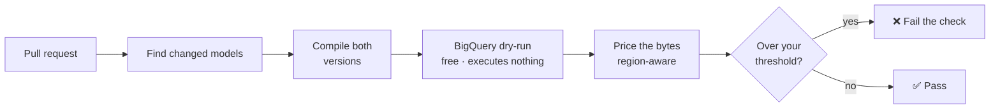
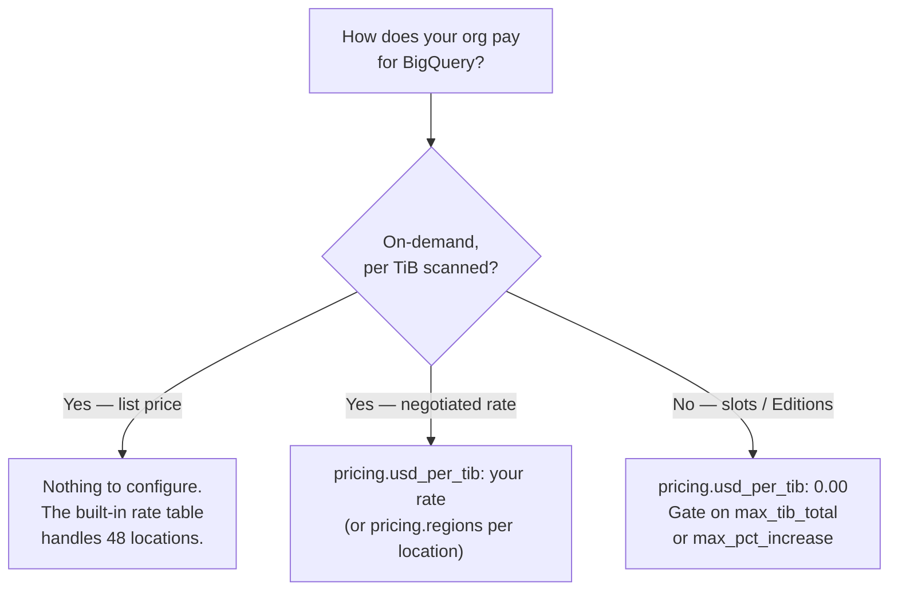

<!-- SPDX-License-Identifier: Apache-2.0 -->

# dbt-costgate, explained

A plain-English guide to what this tool does, what it costs you, what every
setting means, and — just as importantly — what it deliberately refuses to do.

If you only read one line: **dbt-costgate tells you what a dbt pull request is
about to do to your BigQuery bill, before it merges, without running a single
billable query.**

---

## What's in this page

Jump straight to what you need:

| Section | What you'll find | Read it when |
|---|---|---|
| [The short version](#the-short-version) | What it does, in five sentences | You're deciding whether this is for you |
| [How it works](#how-it-works) | The pipeline, step by step | You want to know where the numbers come from |
| [How you run it](#how-you-run-it) | Local check, CI gate, and naming your baselines | You're setting it up |
| [What it costs to run](#what-it-costs-to-run) | Why the tool itself is free | Someone asks "does this scan my data?" |
| [Which pricing setup are you?](#which-pricing-setup-are-you) | On-demand, negotiated, or slots | Your figures look wrong, or you're on Editions |
| [Every configuration key](#every-configuration-key) | Every setting, generated from the code | You want to know what a key does |
| [What it will not do](#what-it-will-not-do) | Deliberate non-goals | You're about to request a feature |
| [When the number can be wrong](#when-the-number-can-be-wrong) | Honest accuracy limits | You're comparing it against your invoice |

Two other documents sit alongside this one: [usage.md](usage.md) is the
task-oriented how-to, and [architecture.md](architecture.md) is the design
rationale for contributors.

---

## The short version

BigQuery can tell you **exactly** how many bytes a query would scan without
running it. That's a dry run, and it's free.

dbt-costgate takes the models your pull request changed, compiles both the old and
new versions, dry-runs each one, converts bytes into money at your region's rate,
and reports the difference. If the increase crosses a threshold you set, the check
fails and the pull request is blocked.

That's the whole idea. Everything below is detail.

---

## How it works



**Find changed models.** Preferably by comparing your branch's compiled dbt
artifacts against `main`'s. It catches more than edited `.sql` files: a changed
macro or a changed config that alters a model's compiled SQL counts too, because
those change what the query scans just as surely.

**Compile both versions.** A cost *difference* needs a before and an after. The
"before" is `main`, compiled the same way your branch was.

**Dry-run each one.** `dryRun=true`. BigQuery returns the byte count it would
scan. Nothing executes, no table data is read, and nothing is billed.

**Price the bytes.** Bytes become money at your region's published rate. Rates
vary by region — from USD 6.25/TiB up to USD 11.25/TiB — so the region matters.
Every report states which rate it used and where that rate came from.

**Gate.** Compare against the thresholds you set and choose an exit code. Nothing
is blocked unless you configured a threshold.

---

## How you run it

**Locally, with no setup.** Compile, then check. It prints what each changed model
scans and what that costs. No baseline, no config, no CI:

```bash
dbt compile
dbt-costgate check
```

**In CI, as a gate.** Give it `main`'s compiled manifest as a baseline and some
thresholds, and it reports the *change* and can block the merge. The GitHub Action
posts a sticky comment that updates in place on every push.

The local mode still gates, using absolute ceilings that need no baseline —
`--max-usd-total` and `--max-tib-total` cap a single model's total, rather than
its increase.

**On your own machine, automatically.** If your team uses pre-commit, there's a
hook. It runs the local check when you *push* — not on every commit, which would
mean waiting on BigQuery all day — so an expensive change gets caught before it
becomes anyone else's review. See the
[usage guide](usage.md#pre-commit-hook).

**On CI that isn't GitHub Actions.** There's a `Dockerfile`. Build it, mount your
project, and the check runs the same way — the exit code is the whole
integration, so GitLab, Jenkins or anything else needs no special support. See
the [usage guide](usage.md#docker-and-ci-that-isnt-github-actions).

There is also a middle option, `dbt-costgate check --against main`, which produces
the baseline for you by checking `main` out into a throwaway git worktree and
compiling it there. Two things to know about it: it reuses your already-installed
`dbt_packages/` rather than running `dbt deps`, so the baseline compiles against
*your branch's* package versions — close enough for a cost baseline, but not a
perfect reconstruction of `main`. And it needs both git and dbt available, which
makes it a local convenience rather than the way to do this in CI.

### Name your baselines once, then stop thinking about them

Everything above involves remembering a path or a ref. You don't have to. Name
your baselines in `.dbt-costgate.yml` and switch between them by name, the way you
switch dbt targets:

```yaml
baselines:
  main:
    against: main                            # compile this git ref
  prod:
    manifest: artifacts/prod/manifest.json   # a manifest someone already built
default_baseline: main
```

```bash
dbt-costgate check --baseline-target prod
dbt-costgate check          # uses default_baseline — no flag at all
```

Each entry is **exactly one** of `manifest:` (a path) or `against:` (a git ref).
Precedence runs most-specific first: an explicit `--baseline`/`--against`, then
`--baseline-target`, then `default_baseline`, then no baseline at all. Passing
more than one is an error rather than a silent winner.

**This is how you solve most of the baseline problems below.** It is config, so it
lives in the repo and applies identically on a laptop and in CI — nobody has to
remember the right invocation, and there is one place to fix it when the answer
changes. In particular, a `manifest:` entry pointing at an artifact compiled the
correct way is the durable answer to the basis-mismatch and package-version
caveats: get the compile right once, name it, and everyone gets it by name.

One portability note: a `manifest:` target travels to CI as long as the path
exists in the runner, while an `against:` target has to compile a ref, so in CI it
needs full git history and dbt available. Locally, `against:` just works.

### Tell it how often each model actually runs

The `$/month` column is `$/run × how often it runs`, and how often it runs is the
one number dbt-costgate cannot observe. A single default across every model in a
diff will be wrong for most of them.

So set it per model. Anything not listed falls back to the default:

```yaml
run_frequency:
  default: 30                 # runs/month for anything not named below
  models:
    fct_orders_daily: 4       # incremental — fully REBUILT weekly, not nightly
    dim_customers: 30         # small dimension, rebuilt daily
    fct_events_hourly: 720
```

Each row of the report states the frequency it used, so a monthly figure is never
an unexplained number:

<!-- BEGIN GENERATED: mixed-frequency-terminal -->
<!-- Generated by scripts/gen_samples.py from the real renderers. Do not edit by hand. -->
```text
dbt-costgate — region: US · on-demand USD 6.25/TiB · built-in table

  fct_orders_daily  (full-refresh): 819.20 GiB → 2.91 TiB   +264%   USD +13.19/run   USD +52.75/month (4 runs)
  dim_customers  (new): — → 412.50 MiB   —   USD +0.00/run   USD +0.07/month (30 runs)

  ⚠ full-refresh — for the rows tagged above, the figure is the full-refresh scan, not an incremental run.

  Net increase: USD 13.19/run · USD 52.82/month

  GATE: FAIL
    - fct_orders_daily: USD +13.19/run exceeds USD 5.00
    - fct_orders_daily: +264% exceeds 25%

  Pricing: US USD 6.25/TiB · built-in table (table 2026.07, verified 2026-07-25)
  Priced from the first byte scanned: BigQuery's 1 TiB/month on-demand free tier is per billing account, so it is disclosed here and never deducted.
  Estimates from BigQuery dry-run — nothing executed, no bytes billed, no SQL shown.
```
<!-- END GENERATED: mixed-frequency-terminal -->

Compare that `USD 52.75/month` against the `USD 395.63/month` the same change
shows at a flat 30 — a **7.5×** difference on one setting, which is why this is
worth a minute of thought rather than leaving everything on the default.

Two things to get right:

- **For an incremental, count full rebuilds, not runs.** The figure being
  multiplied is the full-refresh scan (see
  [the caveat below](#when-the-number-can-be-wrong)), so a model that runs nightly
  but is only rebuilt weekly is `4`, not `30`. Using `30` there overstates its
  monthly cost by roughly 7×.
- **Setting nothing is a valid choice.** With no frequency at all, no monthly
  figure is shown — an absent number rather than a wrong one — and `$/run` and the
  thresholds all still work.

---

## What it costs to run

Nothing, and that is a design constraint rather than a happy accident.

- **Dry runs are free.** They are BigQuery's query-validation path. No bytes are
  billed and no table data is read.
- **The tool never issues any other kind of query.** Not to `INFORMATION_SCHEMA`,
  not for metadata, not "just this once". A change that would issue a billable
  query is treated as a vulnerability, not a feature.
- **It never handles a credential.** Authentication is delegated entirely to
  Application Default Credentials, the same chain dbt-bigquery already uses. There
  are no credential flags to pass and nothing to leak.
- **It has no telemetry.** The BigQuery API is the only endpoint it talks to.
- **Compiled SQL never appears in a report.** SQL can embed secrets through
  `env_var()`, so reports carry model names and numbers only.

---

## Which pricing setup are you?

This is the question that most often explains a surprising figure. Follow it once:



**On-demand at list price.** Nothing to do. The bundled table covers 48 locations
with published rates and states which one it applied.

One thing that catches people out: **rates are not uniform within a country.**
The `US` multi-region is USD 6.25/TiB, but `us-south1` (Dallas) is 7.50 and
`us-west2`/`us-west3` are 8.4375. Across all locations the spread runs from 6.25
up to 11.25 in `southamerica-east1` — so the same query costs 80% more in São
Paulo than in Iowa. If a figure looks higher than you expected, check the region
in the report header first; that is usually the answer.

**A negotiated or Editions rate.** Set your rate and it wins over the table
everywhere. Your override always beats the built-in numbers — that precedence is
deliberate, so updating the bundled table can never silently overwrite the price
you actually pay.

**Capacity or slot pricing.** This one needs saying plainly: **slot cost cannot be
estimated before a query runs.** A dry run reports bytes, never slot time, and
slot consumption only exists once a job has executed. Estimating it would require
running the query, which this tool will not do.

So under slots, bytes scanned is a measure of *work*, not of your invoice. Set the
rate to `0.00` and reports stop showing money entirely — no column of `0.00` to
misread — and gate on the two thresholds that need no rate at all:
`max_tib_total` and `max_pct_increase`. A percentage has no currency, so it works
regardless of how you pay.

If you leave a **dollar** threshold configured at a rate of `0.00`, it can never
fire — every cost is `0.00`, so nothing exceeds anything. The report warns you
and names the setting, but does not block: it is your call whether to change it.
Once you have decided, `notices.silence: [dead-money-thresholds]` stops it
appearing on every pull request. There is no blanket off-switch — silencing is
per notice, so it can never hide one you have not seen.

Worked examples of all three, generated from the real code, are in
[usage.md](usage.md#what-the-report-looks-like-in-your-setup).

### A note on currency

Amounts carry an ISO 4217 code — `USD 6.25/TiB` — rather than a symbol, because
`$` is also CAD, AUD and SGD. Set `pricing.currency` to label amounts in yours.

**It labels; it never converts.** The setting means "the rate I gave you is
denominated in this", not "convert into this". Because the bundled table is in US
dollars, declaring another currency while any region is still priced from that
table stops the run rather than printing a US dollar figure under your label.

---

## Every configuration key

All of these live in `.dbt-costgate.yml` in your project, which travels with your
repo — so it applies identically on your laptop and in CI.

You can also print this table at any time with `dbt-costgate config`. To start
the file itself, run `dbt-costgate init` — it writes a `.dbt-costgate.yml` with
every setting in it and every setting commented out, so nothing changes until
you uncomment something.

> This table is generated from the same registry the code reads, so it cannot
> describe a key that does not exist or omit one that does.

<!-- BEGIN GENERATED: config-reference -->
<!-- Generated by scripts/gen_samples.py from the real renderers. Do not edit by hand. -->
| Key | Type | Default | What it does |
|---|---|---|---|
| `pricing.region` | `str` | _none_ | Force the pricing region. Default: auto-detected from the dry-run job location, falling back to US. |
| `pricing.usd_per_tib` | `float` | _none_ | Flat on-demand rate override (USD/TiB) for every region. Default: the built-in per-region rate table. |
| `pricing.currency` | `str` | _none_ | ISO 4217 code the reported amounts are labelled with, e.g. EUR. Default: USD, matching the built-in table. This labels a rate you supplied yourself — dbt-costgate never converts between currencies — so any region still priced from the built-in table is an error, not a conversion. |
| `pricing.regions` | `map[str->float]` | _empty_ | Per-region rate overrides (region -> USD/TiB) that patch the built-in table. Keys match case-insensitively; 0 is allowed. Unlisted regions use the table. |
| `thresholds.max_usd_increase_per_run` | `float` | _none_ | Gate fails if a model's per-run cost increase exceeds this many USD. |
| `thresholds.max_pct_increase` | `float` | _none_ | Gate fails if a model's cost increases by more than this percent. |
| `thresholds.max_usd_increase_per_month` | `float` | _none_ | Gate fails if a model's projected monthly cost increase exceeds this many USD. |
| `thresholds.max_usd_total` | `float` | _none_ | Absolute ceiling: gate fails if a model's total per-run cost exceeds this many USD, regardless of its increase. Needs no baseline (works in local mode). |
| `thresholds.max_tib_total` | `float` | _none_ | Absolute ceiling: gate fails if a model's total per-run scan exceeds this many TiB, regardless of its increase. Needs no baseline (works in local mode). |
| `run_frequency.default` | `int` | _none_ | Assumed runs per month for the monthly-cost estimate, for models without an explicit entry. |
| `run_frequency.models` | `map[str->int]` | _empty_ | Per-model runs-per-month overrides (model name -> runs) for the monthly estimate. |
| `exclude` | `list[str]` | _empty_ | Model names reported but never gated. |
| `warn_only` | `list[str]` | _empty_ | Model names shown as a warning instead of gated. |
| `renames` | `map[str->str]` | _empty_ | Pair a renamed model to its baseline for a diff (current -> baseline), for when a model rename changes its unique_id and auto-matching can't. Each side is a model name or a full unique_id. Requires a baseline (diff mode). |
| `baselines` | `map[str->{manifest|against}]` | _empty_ | Named baseline sources (dbt --target analogy). Each name maps to either a `manifest:` path or an `against:` git ref. Select one with --baseline-target <name>; a `manifest` target travels to CI, an `against` target needs git+dbt. |
| `default_baseline` | `str` | _none_ | Name of the `baselines:` entry to use when no --baseline/--against/--baseline-target is given, so `dbt-costgate check` diffs without a flag. |
| `report.format` | `terminal|markdown|json` | `terminal` | Output format when not overridden by --format. |
| `fail_on` | `never|warn|fail` | `fail` | Gate strictness: 'never' never fails the build, 'warn' fails on warnings, 'fail' fails only on threshold breaches. |
| `notices.silence` | `list[str]` | _empty_ | Ids of advisory notices to stop reporting, e.g. dead-money-thresholds on a team that has deliberately priced at 0. Each report prints a notice's id beside it, and `dbt-costgate config` lists them. Silencing is per-notice on purpose: there is no blanket off-switch, so turning one off can never hide a different one you have not seen. An unknown id is an error, not a no-op. |
<!-- END GENERATED: config-reference -->

Every CLI flag has a matching GitHub Action input, so anything you can do locally
you can do in CI.

---

## What it will not do

These are deliberate, and each one was decided rather than overlooked.

**It is not a monitoring tool.** It answers "what is *this change* about to do?",
not "what did we spend last month?". Retrospective analysis belongs to
[dbt-bigquery-monitoring](https://github.com/bqbooster/dbt-bigquery-monitoring),
which is complementary, not a competitor.

**It never runs a billable query.** This one has already refused a genuinely
useful feature: reading real per-run scan bytes from `INFORMATION_SCHEMA.JOBS`
would have retired two accuracy caveats below, and it was declined because those
are real queries, billed at a 10 MB minimum. The objection is categorical, not
economic.

**It is BigQuery-first.** One warehouse done accurately beats three done
approximately. Other warehouses come only where the cost model genuinely
transfers — and for slot-based warehouses, per the section above, much of it does
not.

**It prices compute, not storage.** BigQuery bills these on two separate meters:
compute is what a query scans when it runs, storage is what a table costs to sit
there. dbt-costgate is a compute tool end to end — a dry-run reports bytes a
query *would* scan, which is a statement about compute and contains no
information about storage at all. So a change that scans no more than before but
materializes a far larger table reports no cost impact, and that is the tool
answering the question it asks rather than missing one.

> Worth knowing where the boundary bites: a `view` becoming a `table`, or an
> `incremental` becoming a full `table`, moves real money on a meter nothing
> here watches. Storage is billed on bytes held over time, so pricing it would
> mean knowing a table's size and how long it lives — neither of which a dry-run
> of the SQL that builds it can tell you. It is a different tool, not a missing
> feature of this one.

**It does not convert currencies**, model the free tier, or estimate slot cost.

---

## When the number can be wrong

Stated up front, because a cost tool that hides its error bars is worse than none.

Each one says what to do about it. Where there is a real fix, it is named; where
there genuinely isn't one, it says so rather than inventing a workaround.

**Incremental models are priced as a full refresh.** This is the caveat that
surprises people most, so it's worth understanding rather than just noting.

An incremental model compiles differently depending on whether its target table
already exists. Compiled fresh, `is_incremental()` is false, so dbt emits the
**full-refresh** query — no `{{ this }}` self-reference — which dry-runs cleanly.
That is what dbt-costgate measures, and it labels every such row `full-refresh`.

So the figure is **what it costs to rebuild that table**, not what your nightly
incremental run costs. The true per-run cost depends on a predicate like
`WHERE ts > (SELECT MAX(ts) ...)`, whose selectivity is unknowable before the
query runs — BigQuery reports the worst case. dbt-costgate does not fake a number
there; it tells you which basis it used.

The diff is still the useful signal: comparing full-refresh to full-refresh is
apples to apples, and it reliably catches the structural regressions that matter —
a bad join, lost partition pruning, a widened scan.

> **What to do:** nothing to configure — read the figure as rebuild cost. Two
> knock-ons worth knowing: a `max_usd_total` / `max_tib_total` ceiling on an
> incremental caps *rebuild* cost, and `run_frequency` for an incremental should
> reflect how often it is **fully rebuilt**, not how often it runs, or the monthly
> figure will be far too high.

**Comparing two different query shapes is refused, not fudged.** Following from
the above: if your baseline manifest came from a production run, its incrementals
are captured in *incremental* form while your branch's are in full-refresh form.
Diffing those two would produce a confident, meaningless number. dbt-costgate
detects the mismatch and flags the model instead — `mixed basis — baseline is
incremental_form, current is full_refresh; recompile the baseline the same way`.

> **What to do:** compile the baseline the way CI compiles the branch —
> `dbt compile --defer --state path/to/prod/artifacts --favor-state` — then stop
> relying on anyone remembering that. Point a
> [named baseline](#name-your-baselines-once-then-stop-thinking-about-them) at
> the resulting manifest and set it as `default_baseline`, so the correct
> baseline is what a bare `dbt-costgate check` already uses.

**Renaming a model breaks its history.** Models are paired between baseline and
branch by dbt identity (`unique_id`), which is tied to the `.sql` filename. Rename
the file and the pairing is lost — the model is reported as *new* and you lose the
before/after.

> **What to do:** declare the pairing under `renames:` (`current: baseline`, by
> model name or full `unique_id`). An entry it cannot resolve — ambiguous across
> packages, or two models mapped onto one — fails the run rather than mis-diffing
> quietly. Renaming only the **physical table** (a dbt `alias`, `schema`, or
> `database`) does not change the identity, so that case needs nothing at all.

**Percentages get silly when the baseline is tiny.** A model going from 68 MiB to
2.91 TiB is a real and serious regression, and it reads as `+4,474,029%`. That is
arithmetically correct and not very useful. A brand-new model shows `—` instead,
because there is nothing to take a ratio against.

> **What to do:** gate small-baseline models on money or bytes rather than
> percentage — `max_usd_increase_per_run` or `max_tib_total` — and read the
> money column when a percentage goes astronomical. `max_pct_increase` earns its
> keep on models with a substantial baseline, and on slot pricing where it is one
> of the only two rate-free thresholds.

**Not every error is a failure.** A model whose own target table does not exist
yet — normal in a fresh schema or on a new model — is reported as not estimated
and deliberately does *not* fail the run. Only genuinely operational problems
(auth, permissions, an uncompiled manifest) exit 2.

> **What to do:** usually nothing; this is the design. If you want a model's
> problems never to block, `exclude` or `warn_only` it. And note that when models
> cannot be estimated, the net line says how many were left out rather than
> presenting a partial sum as a total.

**Models you exclude from gating still count toward the net.** `exclude` and
`warn_only` stop a model from *failing* the gate; they do not pretend it costs
nothing. Its spend is real, so it is included in the net impact figure.

> **What to do:** nothing — this is deliberate. The gate is a policy verdict and
> the net is a measurement, which is also why a report can show a net saving while
> the gate still fails on one model that breached its own threshold.

**Monthly figures use an assumption you supply.** `run_frequency` is a number you
configure, not something measured. If a model actually runs 90 times a month and
you told it 30, the monthly figure is a third of reality.

> **What to do:** set
> [`run_frequency.models` per model](#tell-it-how-often-each-model-actually-runs)
> for anything whose cadence differs from the default — on the worked example
> there, one setting moves the monthly figure by 7.5×. If you set no frequency at
> all, no monthly figure is shown: an absent number rather than a wrong one.

**Dynamic filters read as worst case.** A predicate like `CURRENT_DATE()` cannot
be resolved at dry-run time, so BigQuery reports a full-table scan.

> **What to do:** those models are flagged in the report, so you can see which
> they are. Put heavily-partitioned ones under `warn_only` to keep reporting them
> without blocking, or `exclude` to drop them from gating entirely.

**The free tier is disclosed, never deducted.** BigQuery's on-demand pricing
includes the first 1 TiB of query data processed each month free — and that
allowance belongs to the whole **billing account**, not to your dbt project. Every
other query anyone runs that month draws it down. A dry-run reports bytes for one
statement and says nothing about the account's month to date, so dbt-costgate
prices from the first byte and states so in the footer of every priced report.

> **What to do:** nothing available, and the bias is deliberate — over-reporting
> a small change is safer for a gate than under-reporting one. It matters least
> where it matters most: on any change big enough to be worth blocking, one free
> TiB is noise. There is deliberately no setting to switch it on: it could only
> ever mean "assume the tier is still unspent", which is a claim about the entire
> billing account that the tool has no way to check, and a gate that quietly
> forgives the first TiB of a regression because of an unverified assumption is
> worse than one that over-reports honestly. Note the tier is an on-demand
> allowance and does not apply under capacity/Editions pricing at all.

**Config changes with identical compiled SQL are invisible.** Changing
`partition_by` or `cluster_by` may not change *this* model's compiled SQL at all.
It changes what *downstream* queries scan, which this tool does not model.

> **What to do:** no fix — dbt-costgate prices the model in front of it, not the
> queries other people will run against it later. Worth knowing that a clustering
> change reviewed here as "no cost impact" may still be significant downstream.

**Bundled rates are best-effort, and a fallback under-reports.** Every rate
carries a `last_verified` date and every report names its source. A location that
is not in the table — one Google opened after the table was cut — falls back to
the default rate. That default is the *lowest* rate BigQuery charges anywhere, so
a fallback figure is likely too low, which is the wrong direction for a gate.

> **What to do:** the report warns when this happens and names the location, so
> it is never silent. Set the rate you actually pay with `pricing.regions` for
> that one location, `pricing.usd_per_tib` for a flat rate everywhere, or
> `pricing.region` to pin pricing to a location you do have a rate for. The same
> applies if your rate differs from list price for any other reason — negotiated
> or Editions. Your value always wins over the table, so updating the bundled
> rates can never overwrite the price you actually pay. Adding a verified
> location to the table is a one-line pull request.

---

## Where to go next

- **[usage.md](usage.md)** — the how-to: installing, CI setup, baselines,
  thresholds, the GitHub Action, worked examples for every pricing setup
- **[architecture.md](architecture.md)** — why it is built this way, for
  contributors
- **[SECURITY.md](../SECURITY.md)** — the threat model and what counts as a
  vulnerability
- **[CONTRIBUTING.md](../CONTRIBUTING.md)** — the invariants any change has to
  respect
